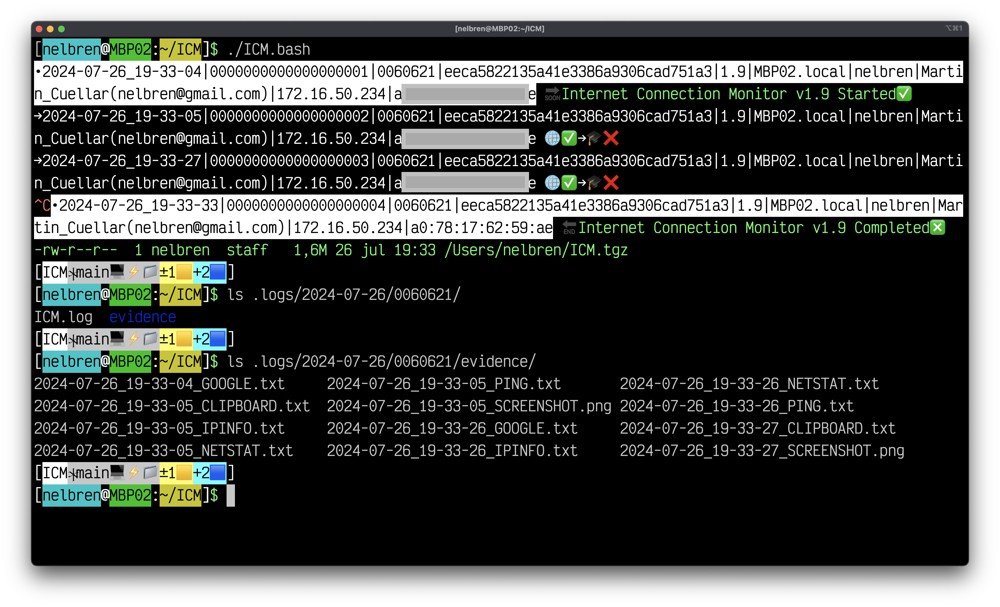

# 🌐 Internet Connection Monitor (ICM) 🔌

|Version|Date|Updated on OS|Supported on OS|md5sum|
|--:|--:|:--:|:--:|--:|
|`6.5`|`2025-06-08 23:20`|🪟|🍎🪟🐧|`df77636462fe22025f87aa388935dd10`|

A bash script for **🪟Windows** (using git bash), **🍎MacOS** and **🐧Linux** that continuously checks the internet connection, keeps a log of each check, and if it identifies an internet connection, it takes evidence (web access, open ports, ping, access address information, screenshot and clipboard content capture). Upon completion it creates a **TGZ** file with the log and all captured evidence.

## How to use it

1. ## 💾 Install **ICM** using **git bash** on **🪟Windows** or **Terminal/iTerm** on **🍎MacOS** or **Terminal** on **🐧Linux**
  
    `git clone https://github.com/nelbren/ICM.git`

2. ## 💿 Switch to the directory

   - ICM if running alone:

     `cd ICM`

   - Project

     `cd PROJECT`

     **NOTE:** Please use `git init` in this directory or use `NOGIT` as third parameter.

3. ## 🏃 Run the script

   - ### 🌐 With connection to ICMd

     - #### With Git

         Run the alias:

            `ICM IP-OF-ICMDd ID`

     - #### Without Git

         Run the alias:

            `ICM IP-OF-ICMDd ID NOGIT`

   - ### 💻 Alone (Without connection to ICMd)

        `./ICM.bash`

4. ## 🧙 Wait for the magic

   

5. ## 🛑 Stop the script

   `Control` ➕ `C`

6. ## Review logs and evidence

   In the user's home there is a file called **`ICM.tgz`** with the **log** and **evidence**, sorted by **day** and the **number of execution process**.

7. ## Troubleshooting for **🪟Windows** | **🍎MacOS**

   - ### 🌐 Enable Internet

       Run the alias:
       `INTERNET_ENABLE`

   - ### 🚫 Disable Internet

       Run the alias:
       `INTERNET_DISABLE`

<!-- markdownlint-disable MD033 -->

MADE WITH 💛 BY NELBREN

