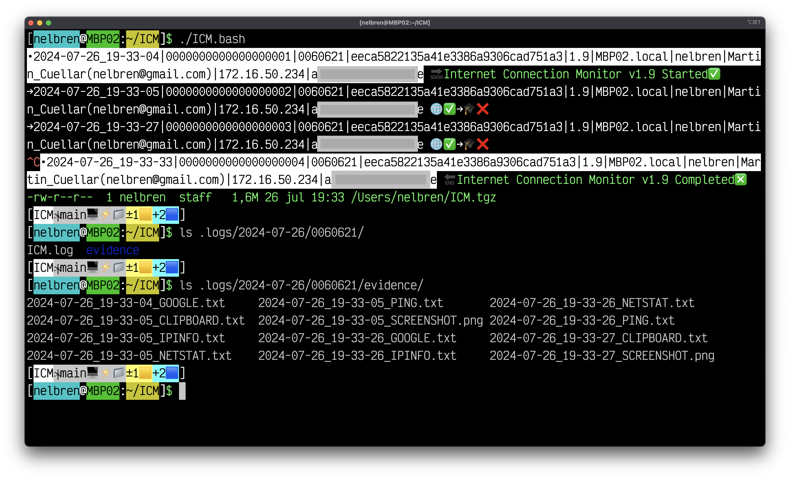

# 🌐 Internet Connection Monitor (ICM) 🔌

|Version|md5sum|
|--:|--:|
|`2.6`|`0a5ffe65b97daaf50399b3c17697220a`|

A bash script for **Windows** (using git bash) and MacOS that continuously checks the internet connection, keeps a log of each check, and if it identifies an internet connection, it takes evidence (web access, open ports, ping, access address information, screenshot and clipboard content capture). Upon completion it creates a **TGZ** file with the log and all captured evidence.

# How to use it:

1. ## 💾 Install **ICM** using **git bash** on **Windows** or **Terminal/iTerm** on **MacOS**:
  
    `git clone https://github.com/nelbren/ICM.git`

2. ## 💿 Switch to the ICM directory:

    `cd ICM`

3. ## 🏃 Run the script:

    `./ICM.bash`

    o

    `bash ICM.bash`

4. ## 🧙 Wait for the magic!
   
   
5. ## 🛑 Stop the script
   `Control` ➕ `C`

6. ## Review logs and evidence

   In the user's home there is a file called **`ICM.tgz`** with the **log** and **evidence**, sorted by **day** and the **number of execution process**.

MADE WITH 💛 BY NELBREN

